# Arquitectura Frontend SPA (Svelte + Vite)

Guia de arquitectura del frontend actual de `spa/`, pensada para entender rapido la base tecnica y como esta componentizada la app.
Incluye diagramas Mermaid para arquitectura de capas, ruteo, flujo de datos, carrito/checkout y estructura de features.

---

## 1. Vision General

La SPA esta organizada por **features** (Home, Eventos, Amigos), con una capa de **servicios compartidos** para reglas de negocio y puente al legacy PHP.

La estructura principal en `src/` es:

- `App.svelte`: ruteo minimo por `pathname` y `query params`.
- `features/`: modulos por dominio funcional.
- `services/`: logica compartida de datos, carrito y checkout.
- `shared/`: componentes reutilizables, helpers de modelo y tokens visuales.
- `app/config/`: configuracion general de la migracion.

Referencia:
- `src/App.svelte`
- `src/features/`
- `src/services/`
- `src/shared/`

### Diagrama: Arquitectura de capas

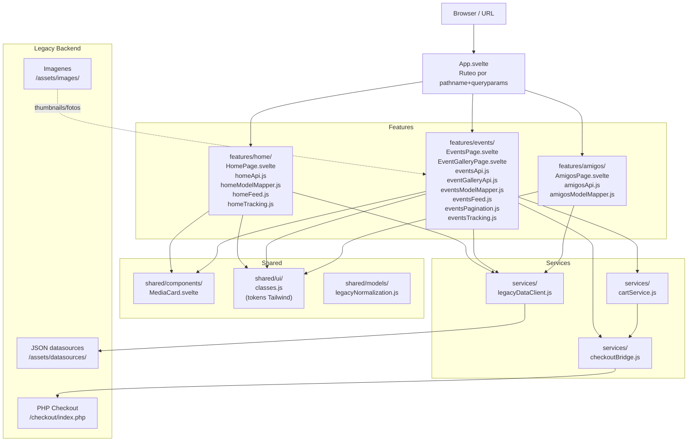
```mermaid
graph TD
  Browser["Browser / URL"]
  App["App.svelte\nRuteo por pathname+queryparams"]

  subgraph Features
    Home["features/home/\nHomePage.svelte\nhomeApi.js\nhomeModelMapper.js\nhomeFeed.js\nhomeTracking.js"]
    Events["features/events/\nEventsPage.svelte\nEventGalleryPage.svelte\neventsApi.js\neventGalleryApi.js\neventsModelMapper.js\neventsFeed.js\neventsPagination.js\neventsTracking.js"]
    Amigos["features/amigos/\nAmigosPage.svelte\namigosApi.js\namigosModelMapper.js"]
  end

  subgraph Shared
    MediaCard["shared/components/\nMediaCard.svelte"]
    UIClasses["shared/ui/\nclasses.js\n(tokens Tailwind)"]
    LegacyNorm["shared/models/\nlegacyNormalization.js"]
  end

  subgraph Services
    DataClient["services/\nlegacyDataClient.js"]
    CartSvc["services/\ncartService.js"]
    Checkout["services/\ncheckoutBridge.js"]
  end

  subgraph LegacyBackend["Legacy Backend"]
    JSON["JSON datasources\n/assets/datasources/"]
    Images["Imagenes\n/assets/images/"]
    PHP["PHP Checkout\n/checkout/index.php"]
  end

  Browser --> App
  App --> Home
  App --> Events
  App --> Amigos

  Home --> MediaCard
  Events --> MediaCard
  Events --> CartSvc
  Events --> Checkout

  Home --> UIClasses
  Events --> UIClasses
  Amigos --> UIClasses

  Home --> DataClient
  Events --> DataClient
  Amigos --> DataClient

  CartSvc --> Checkout
  DataClient --> JSON
  Checkout --> PHP
  Images -.->|thumbnails/fotos| Events
```

---

## 2. Mapa de Capas

Cada feature repite un patron simple y consistente:

1. `*Page.svelte`: capa de presentacion + estado de UI (`loading/error/empty/ready`).
2. `*Api.js`: capa de acceso a datos y orquestacion de datasource legacy.
3. `*ModelMapper.js`: normaliza payload legacy al modelo SPA.
4. Helpers opcionales: feed, tracking, paginacion, etc.
5. `*.test.js`: tests unitarios/integracion por modulo.

Ejemplos:
- Home: `src/features/home/HomePage.svelte`, `src/features/home/homeApi.js`, `src/features/home/homeModelMapper.js`
- Eventos: `src/features/events/EventsPage.svelte`, `src/features/events/eventsApi.js`, `src/features/events/eventsModelMapper.js`
- Amigos: `src/features/amigos/AmigosPage.svelte`, `src/features/amigos/amigosApi.js`, `src/features/amigos/amigosModelMapper.js`

### Diagrama: Patron interno de una feature

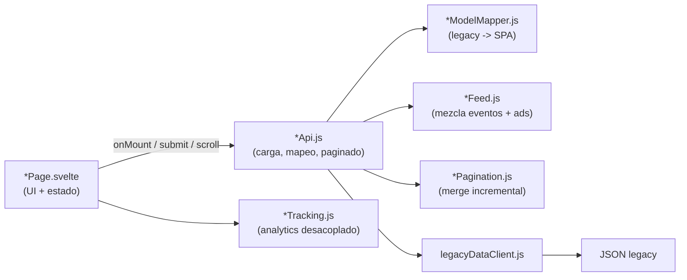
```mermaid
graph LR
  Page["*Page.svelte\n(UI + estado)"]
  Api["*Api.js\n(carga, mapeo, paginado)"]
  Mapper["*ModelMapper.js\n(legacy -> SPA)"]
  Feed["*Feed.js\n(mezcla eventos + ads)"]
  Tracking["*Tracking.js\n(analytics desacoplado)"]
  Pagination["*Pagination.js\n(merge incremental)"]
  DataClient["legacyDataClient.js"]
  JSON["JSON legacy"]

  Page -->|"onMount / submit / scroll"| Api
  Api --> Mapper
  Api --> Feed
  Api --> Pagination
  Page --> Tracking
  Api --> DataClient
  DataClient --> JSON
```

### Diagrama: Arbol de archivos por feature

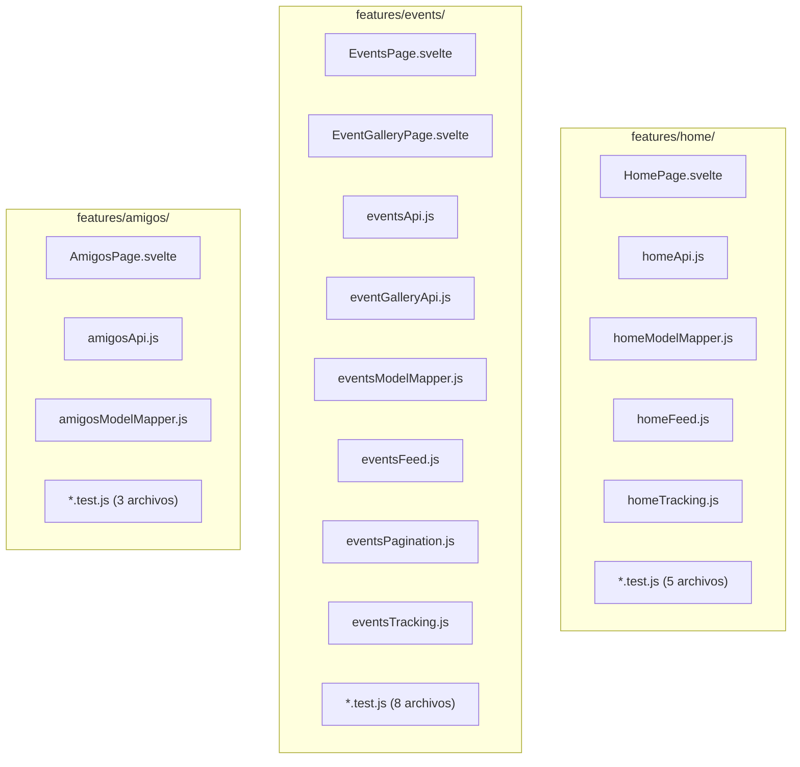
```mermaid
graph TD
  subgraph home["features/home/"]
    HP["HomePage.svelte"]
    HA["homeApi.js"]
    HM["homeModelMapper.js"]
    HF["homeFeed.js"]
    HT["homeTracking.js"]
    HTests["*.test.js (5 archivos)"]
  end

  subgraph events["features/events/"]
    EP["EventsPage.svelte"]
    EGP["EventGalleryPage.svelte"]
    EA["eventsApi.js"]
    EGA["eventGalleryApi.js"]
    EM["eventsModelMapper.js"]
    EF["eventsFeed.js"]
    EPag["eventsPagination.js"]
    ET["eventsTracking.js"]
    ETests["*.test.js (8 archivos)"]
  end

  subgraph amigos["features/amigos/"]
    AP["AmigosPage.svelte"]
    AA["amigosApi.js"]
    AM["amigosModelMapper.js"]
    ATests["*.test.js (3 archivos)"]
  end
```

---

## 3. Ruteo (Simple y Explicito)

No hay router externo (todavia). `App.svelte` decide que pagina renderizar usando `window.location.pathname` y, en eventos, tambien query params:

- `/eventos` -> `EventsPage`
- `/eventos?id=...` o `/eventos?g=...` -> `EventGalleryPage`
- `/amigos` -> `AmigosPage`
- resto -> `HomePage`

Referencia:
- `src/App.svelte`

### Equivalencia mental con React

- Seria parecido a un `App.tsx` con `if/else` en vez de `react-router`.
- `EventGalleryPage` funciona como una ruta derivada por query string.

### Diagrama: Arbol de ruteo actual

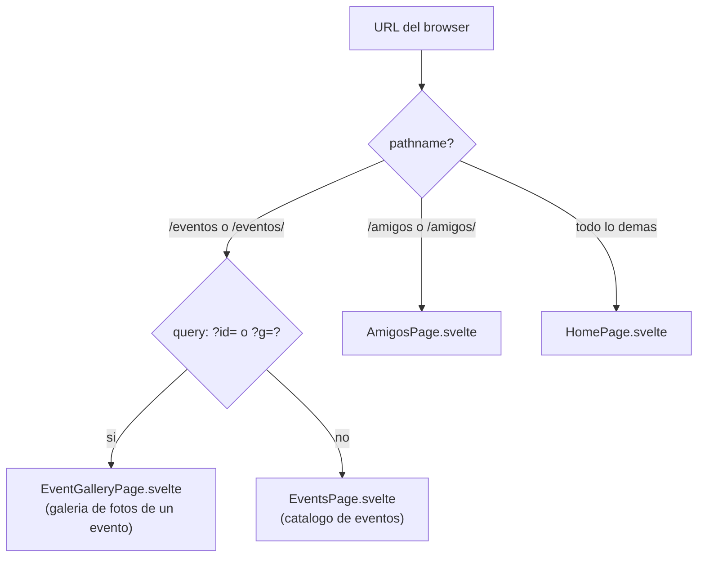
```mermaid
flowchart TD
  URL["URL del browser"]
  PathCheck{pathname?}
  EventQueryCheck{query: ?id= o ?g=?}

  URL --> PathCheck

  PathCheck -->|"/eventos o /eventos/"| EventQueryCheck
  PathCheck -->|"/amigos o /amigos/"| AP["AmigosPage.svelte"]
  PathCheck -->|"todo lo demas"| HP["HomePage.svelte"]

  EventQueryCheck -->|"si"| EGP["EventGalleryPage.svelte\n(galeria de fotos de un evento)"]
  EventQueryCheck -->|"no"| EP["EventsPage.svelte\n(catalogo de eventos)"]
```

---

## 4. Flujo de Datos End-to-End

Flujo tipico en una pantalla:

1. `onMount` en `*Page.svelte` dispara carga.
2. La pagina llama a `*Api.js`.
3. La API usa `fetchLegacyJson` (`services/legacyDataClient.js`).
4. El payload se mapea a un contrato SPA estable.
5. La pagina actualiza estado y renderiza componentes.

Referencia:
- `src/services/legacyDataClient.js`
- `src/features/home/homeApi.js`
- `src/features/events/eventsApi.js`
- `src/features/events/eventGalleryApi.js`

### Equivalencia con React

- `onMount` ~= `useEffect(() => { ... }, [])`
- variables locales reactivas de Svelte ~= `useState`
- declaraciones reactivas `$:` ~= `useMemo`/derivados calculados (sin hooks explicitos)

### Diagrama: Flujo de datos tipico (carga de pagina)

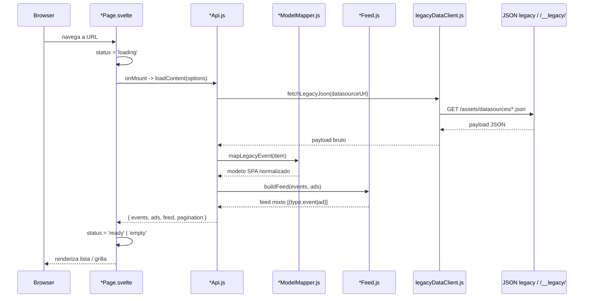
```mermaid
sequenceDiagram
  participant Browser
  participant Page as *Page.svelte
  participant Api as *Api.js
  participant Mapper as *ModelMapper.js
  participant Feed as *Feed.js
  participant Client as legacyDataClient.js
  participant Legacy as JSON legacy / /__legacy/

  Browser->>Page: navega a URL
  Page->>Page: status = 'loading'
  Page->>Api: onMount -> loadContent(options)
  Api->>Client: fetchLegacyJson(datasourceUrl)
  Client->>Legacy: GET /assets/datasources/*.json
  Legacy-->>Client: payload JSON
  Client-->>Api: payload bruto
  Api->>Mapper: mapLegacyEvent(item)
  Mapper-->>Api: modelo SPA normalizado
  Api->>Feed: buildFeed(events, ads)
  Feed-->>Api: feed mixto [{type,event|ad}]
  Api-->>Page: { events, ads, feed, pagination }
  Page->>Page: status = 'ready' | 'empty'
  Page-->>Browser: renderiza lista / grilla
```

### Diagrama: Flujo de busqueda (eventos)

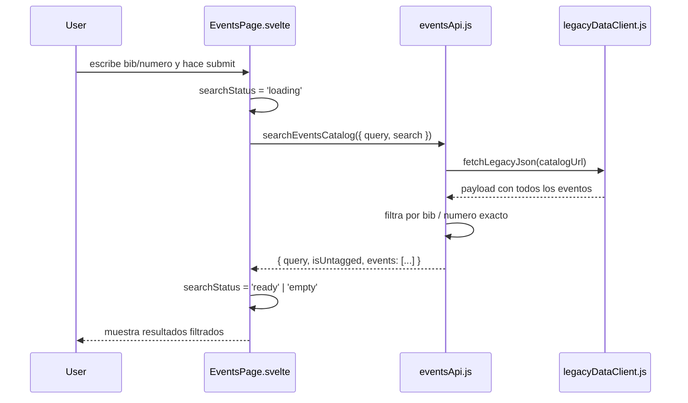
```mermaid
sequenceDiagram
  participant User
  participant Page as EventsPage.svelte
  participant Api as eventsApi.js
  participant Client as legacyDataClient.js

  User->>Page: escribe bib/numero y hace submit
  Page->>Page: searchStatus = 'loading'
  Page->>Api: searchEventsCatalog({ query, search })
  Api->>Client: fetchLegacyJson(catalogUrl)
  Client-->>Api: payload con todos los eventos
  Api->>Api: filtra por bib / numero exacto
  Api-->>Page: { query, isUntagged, events: [...] }
  Page->>Page: searchStatus = 'ready' | 'empty'
  Page-->>User: muestra resultados filtrados
```

### Diagrama: Fallback de datasource (mirror + local)

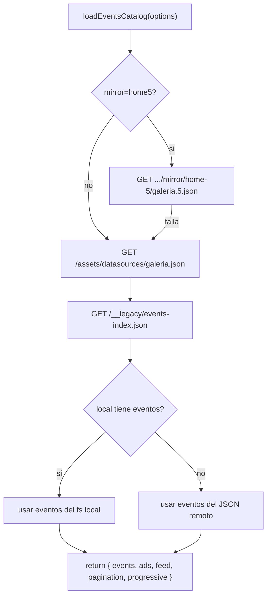
```mermaid
flowchart TD
  Start["loadEventsCatalog(options)"]
  Mirror{mirror=home5?}
  TryMirror["GET .../mirror/home-5/galeria.5.json"]
  TryDefault["GET /assets/datasources/galeria.json"]
  TryLocal["GET /__legacy/events-index.json"]
  FallbackOk{local tiene eventos?}
  UseLocal["usar eventos del fs local"]
  UseRemote["usar eventos del JSON remoto"]
  Return["return { events, ads, feed, pagination, progressive }"]

  Start --> Mirror
  Mirror -->|si| TryMirror
  Mirror -->|no| TryDefault
  TryMirror -->|falla| TryDefault
  TryDefault --> TryLocal
  TryLocal --> FallbackOk
  FallbackOk -->|si| UseLocal
  FallbackOk -->|no| UseRemote
  UseLocal --> Return
  UseRemote --> Return
```

---

## 5. Componentizacion Actual

## 5.1 Componentes de pagina

Son contenedores de feature. Manejan:

- carga inicial
- estados de UI
- wiring de acciones (busqueda, carrito, checkout, scroll)

Archivos:
- `src/features/home/HomePage.svelte`
- `src/features/events/EventsPage.svelte`
- `src/features/events/EventGalleryPage.svelte`
- `src/features/amigos/AmigosPage.svelte`

## 5.2 Componentes compartidos

Por ahora hay una pieza UI central:

- `MediaCard.svelte`: card reutilizable para eventos y ads.

Recibe props (`variant`, `href`, `label`, `imageUrl`, `target`) y callback de tracking (`onTrack`).

### Diagrama: Props y slots de MediaCard

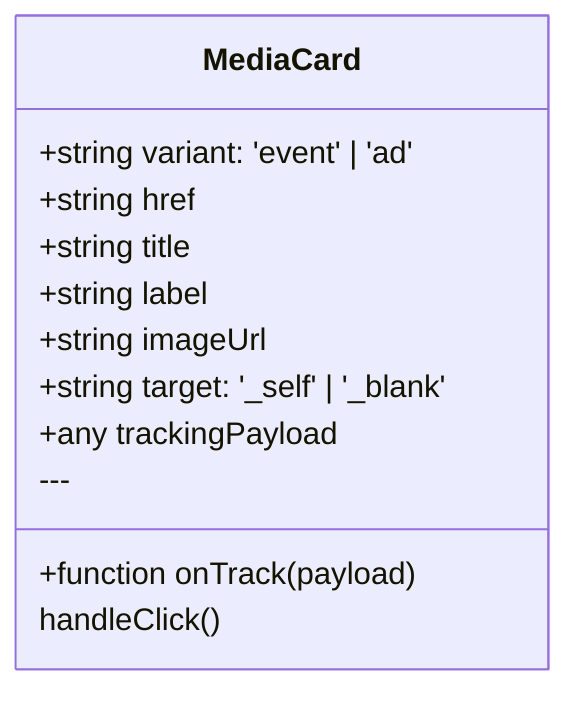
```mermaid
classDiagram
  class MediaCard {
    +string variant: 'event' | 'ad'
    +string href
    +string title
    +string label
    +string imageUrl
    +string target: '_self' | '_blank'
    +any trackingPayload
    +function onTrack(payload)
    ---
    handleClick()
  }
```

Archivo:
- `src/shared/components/MediaCard.svelte`

## 5.3 Tokens visuales compartidos

No hay una libreria de componentes pesada; se usa Tailwind con una capa minima de clases reutilizables:

- `src/shared/ui/classes.js`

Los tokens clave son:

| Token | Uso |
|---|---|
| `narrowPageShellClass` | contenedor de pagina ancho maximo ~960px |
| `widePageShellClass` | contenedor ancho maximo ~1120px (galeria) |
| `cardGridClass` | grilla auto-fill de cards (min 220px) |
| `statusMessageClass` | estado loading/error/empty |
| `panelClass` | panel laterales y carrito |
| `actionButtonClass` | boton primario (checkout, buscar) |
| `compactButtonClass` | boton pequeno (quitar del carrito) |
| `photoCardClass` | card de foto en galeria |

---

## 6. Dominio y Servicios Compartidos

### Diagrama: Relacion entre servicios

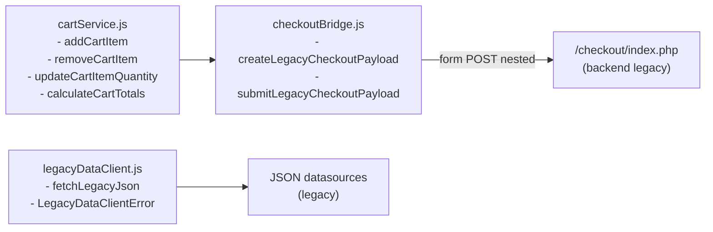
```mermaid
graph LR
  Cart["cartService.js\n- addCartItem\n- removeCartItem\n- updateCartItemQuantity\n- calculateCartTotals"]
  Bridge["checkoutBridge.js\n- createLegacyCheckoutPayload\n- submitLegacyCheckoutPayload"]
  Client["legacyDataClient.js\n- fetchLegacyJson\n- LegacyDataClientError"]
  PHP["/checkout/index.php\n(backend legacy)"]
  JSON["JSON datasources\n(legacy)"]

  Cart --> Bridge
  Bridge -->|"form POST nested"| PHP
  Client --> JSON
```

## 6.1 Cliente legacy

- `fetchLegacyJson(url)` centraliza fetch y errores tipados (`LegacyDataClientError`).
- Inyectable en tests via parametro `dataClient`.

Archivo:
- `src/services/legacyDataClient.js`

## 6.2 Carrito

- `cartService.js` encapsula reglas de carrito:
  - normalizacion de item
  - agregar/quitar/actualizar cantidad
  - calculo de totales
  - regla promo (`cantidad >= 5 => total 0`)

### Modelo de item de carrito

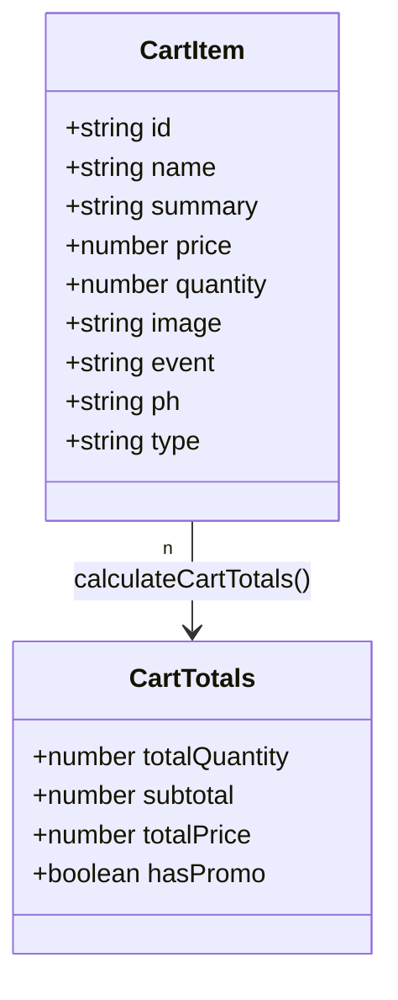
```mermaid
classDiagram
  class CartItem {
    +string id
    +string name
    +string summary
    +number price
    +number quantity
    +string image
    +string event
    +string ph
    +string type
  }
  class CartTotals {
    +number totalQuantity
    +number subtotal
    +number totalPrice
    +boolean hasPromo
  }
  CartItem "n" --> CartTotals : calculateCartTotals()
```

Archivo:
- `src/services/cartService.js`

## 6.3 Checkout bridge

- `checkoutBridge.js` adapta carrito SPA al formato esperado por backend PHP (`/checkout/index.php`).
- El submit por defecto crea y envia un `form POST` con campos nested (`products[index][field]`).
- Admite `submitter` inyectable para tests.

### Diagrama: Flujo carrito -> checkout

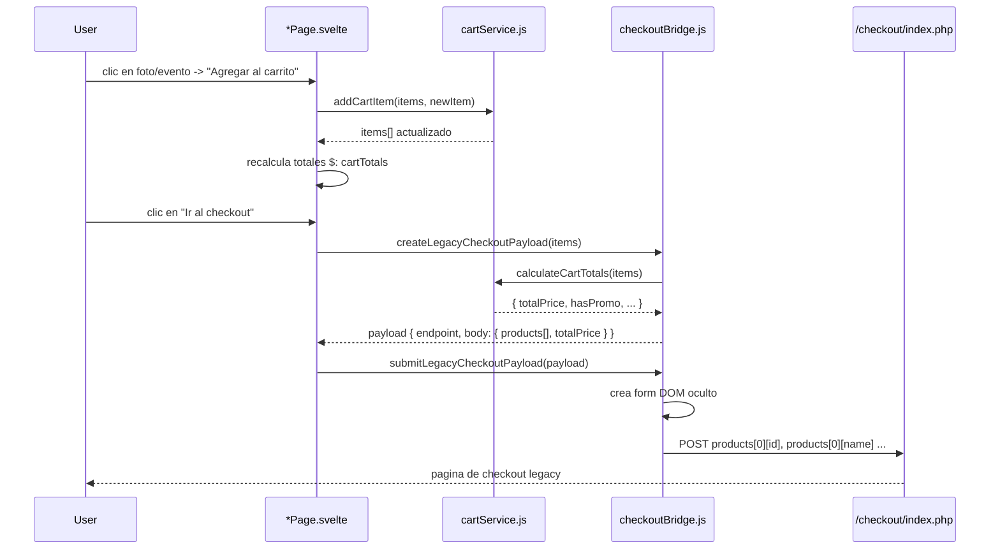
```mermaid
sequenceDiagram
  participant User
  participant Page as *Page.svelte
  participant Cart as cartService.js
  participant Bridge as checkoutBridge.js
  participant PHP as /checkout/index.php

  User->>Page: clic en foto/evento -> "Agregar al carrito"
  Page->>Cart: addCartItem(items, newItem)
  Cart-->>Page: items[] actualizado
  Page->>Page: recalcula totales $: cartTotals

  User->>Page: clic en "Ir al checkout"
  Page->>Bridge: createLegacyCheckoutPayload(items)
  Bridge->>Cart: calculateCartTotals(items)
  Cart-->>Bridge: { totalPrice, hasPromo, ... }
  Bridge-->>Page: payload { endpoint, body: { products[], totalPrice } }

  Page->>Bridge: submitLegacyCheckoutPayload(payload)
  Bridge->>Bridge: crea form DOM oculto
  Bridge->>PHP: POST products[0][id], products[0][name] ...
  PHP-->>User: pagina de checkout legacy
```

### Equivalencia con React

Esto seria similar a tener `domain services` o `useCases` fuera de componentes para mantenerlos "thin".

---

## 7. Features: Como Estan Armadas

## 7.1 Home

- `homeApi.js` resuelve datasource (`inicio.json` o mirror `home5`), mapea eventos y ads, y construye feed mixto.
- `homeModelMapper.js` normaliza contrato de evento.
- `homeTracking.js` desacopla analytics de clic.

### Modelo de evento (Home)

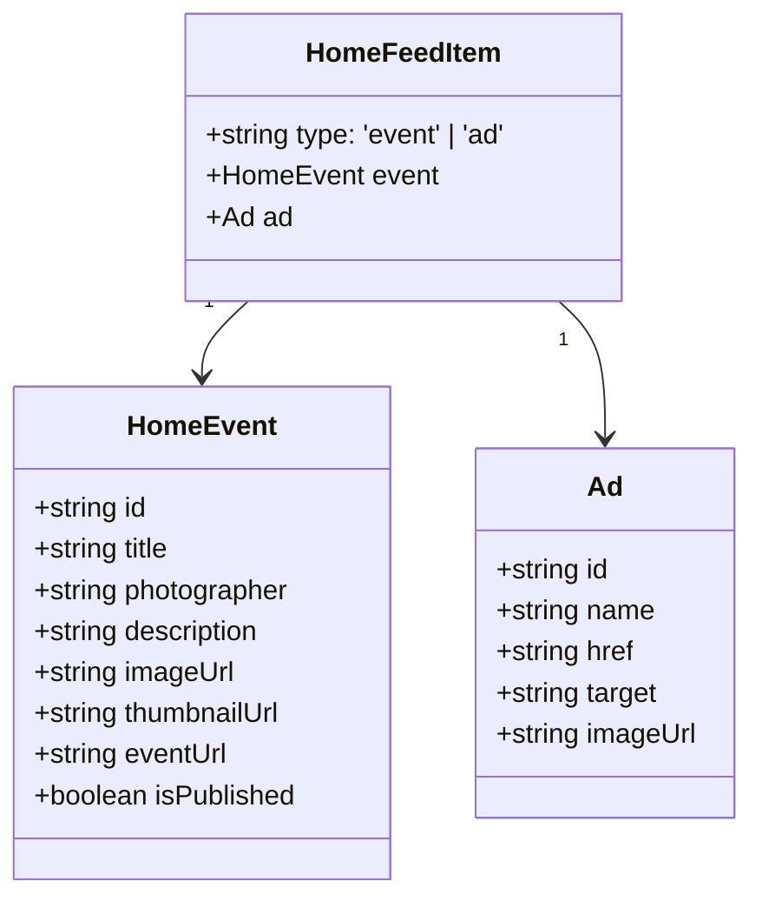
```mermaid
classDiagram
  class HomeEvent {
    +string id
    +string title
    +string photographer
    +string description
    +string imageUrl
    +string thumbnailUrl
    +string eventUrl
    +boolean isPublished
  }
  class HomeFeedItem {
    +string type: 'event' | 'ad'
    +HomeEvent event
    +Ad ad
  }
  class Ad {
    +string id
    +string name
    +string href
    +string target
    +string imageUrl
  }
  HomeFeedItem "1" --> HomeEvent
  HomeFeedItem "1" --> Ad
```

Archivos:
- `src/features/home/homeApi.js`
- `src/features/home/homeModelMapper.js`
- `src/features/home/homeTracking.js`

## 7.2 Eventos (catalogo)

- `eventsApi.js` carga catalogo con paginado y busqueda por bib/numero.
- Soporta mirror `home5` y fallback local para desarrollo.
- `eventsFeed.js` intercala ads en el feed cada 6 eventos.
- `eventsPagination.js` hace merge incremental con deduplicacion por clave compuesta.
- `eventsTracking.js` centraliza tracking de clics y busquedas.

### Modelo de evento (catalogo)

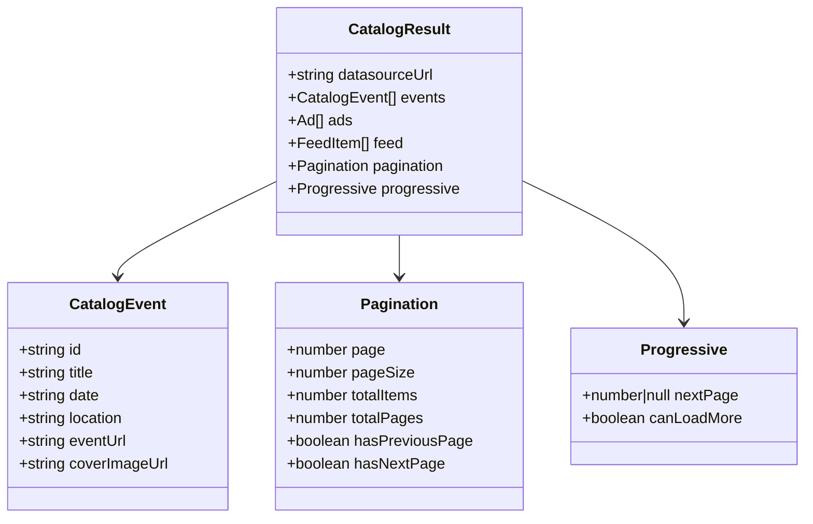
```mermaid
classDiagram
  class CatalogEvent {
    +string id
    +string title
    +string date
    +string location
    +string eventUrl
    +string coverImageUrl
  }
  class CatalogResult {
    +string datasourceUrl
    +CatalogEvent[] events
    +Ad[] ads
    +FeedItem[] feed
    +Pagination pagination
    +Progressive progressive
  }
  class Pagination {
    +number page
    +number pageSize
    +number totalItems
    +number totalPages
    +boolean hasPreviousPage
    +boolean hasNextPage
  }
  class Progressive {
    +number|null nextPage
    +boolean canLoadMore
  }
  CatalogResult --> CatalogEvent
  CatalogResult --> Pagination
  CatalogResult --> Progressive
```

### Diagrama: Infinite scroll

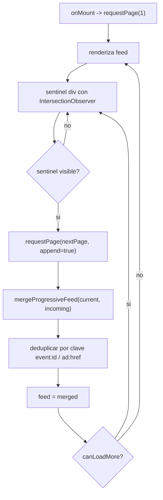
```mermaid
flowchart TD
  Mount["onMount -> requestPage(1)"]
  RenderList["renderiza feed"]
  Sentinel["sentinel div con IntersectionObserver"]
  Intersect{sentinel visible?}
  LoadMore["requestPage(nextPage, append=true)"]
  Merge["mergeProgressiveFeed(current, incoming)"]
  Dedup["deduplicar por clave event:id / ad:href"]
  UpdateFeed["feed = merged"]
  End{canLoadMore?}

  Mount --> RenderList
  RenderList --> Sentinel
  Sentinel --> Intersect
  Intersect -->|si| LoadMore
  Intersect -->|no| Sentinel
  LoadMore --> Merge
  Merge --> Dedup
  Dedup --> UpdateFeed
  UpdateFeed --> End
  End -->|si| Sentinel
  End -->|no| RenderList
```

Archivos:
- `src/features/events/eventsApi.js`
- `src/features/events/eventsFeed.js`
- `src/features/events/eventsPagination.js`
- `src/features/events/eventsTracking.js`

## 7.3 Galeria por evento

- `eventGalleryApi.js` carga fotos por evento, soporta mirror/fallback local y filtro por bib o "sin clasificar".
- `EventGalleryPage.svelte` maneja busqueda, paginado y carrito por foto.

### Modelo de foto

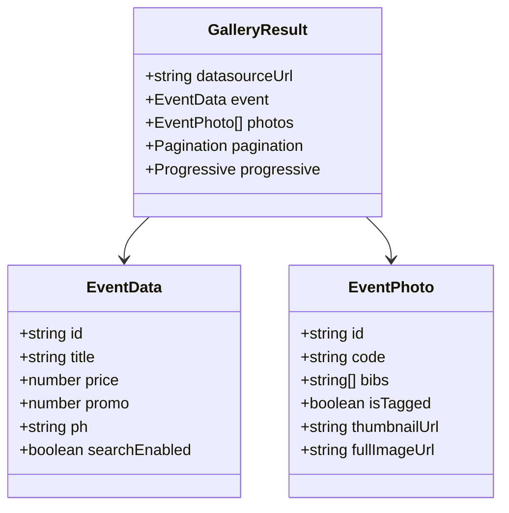
```mermaid
classDiagram
  class EventPhoto {
    +string id
    +string code
    +string[] bibs
    +boolean isTagged
    +string thumbnailUrl
    +string fullImageUrl
  }
  class EventData {
    +string id
    +string title
    +number price
    +number promo
    +string ph
    +boolean searchEnabled
  }
  class GalleryResult {
    +string datasourceUrl
    +EventData event
    +EventPhoto[] photos
    +Pagination pagination
    +Progressive progressive
  }
  GalleryResult --> EventData
  GalleryResult --> EventPhoto
```

Archivos:
- `src/features/events/eventGalleryApi.js`
- `src/features/events/EventGalleryPage.svelte`

## 7.4 Amigos

- `amigosApi.js` intenta leer `/assets/datasources/amigos.json`.
- Si no existe, usa fallback embedded compatible con el contenido legacy actual.
- `amigosModelMapper.js` normaliza campos (`title`, `category`, `lugar`, etc.).

### Modelo de amigo

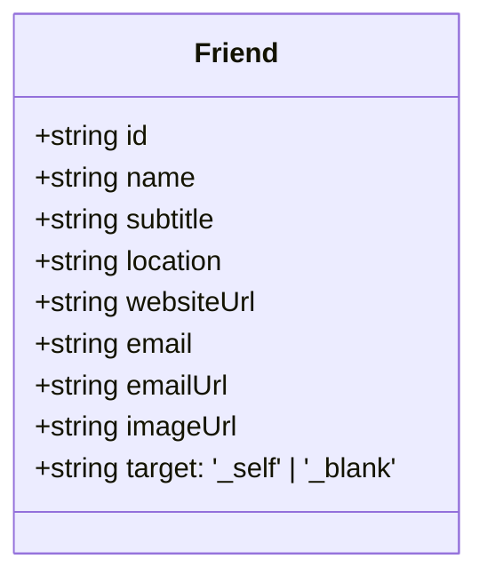
```mermaid
classDiagram
  class Friend {
    +string id
    +string name
    +string subtitle
    +string location
    +string websiteUrl
    +string email
    +string emailUrl
    +string imageUrl
    +string target: '_self' | '_blank'
  }
```

Archivos:
- `src/features/amigos/amigosApi.js`
- `src/features/amigos/amigosModelMapper.js`
- `src/features/amigos/AmigosPage.svelte`

---

## 8. Integracion con Legacy en Desarrollo

Vite tiene un middleware (`legacy-assets-bridge`) para servir assets legacy y construir endpoints dev-only:

- `/assets/*` desde `../assets`
- `/__legacy/events-index.json`
- `/__legacy/event-gallery.json?id=...`

### Diagrama: Bridge de assets legacy en dev

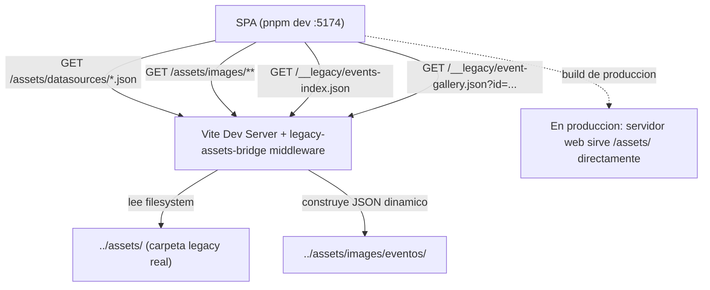
```mermaid
graph TD
  SPA["SPA (pnpm dev :5174)"]
  Vite["Vite Dev Server + legacy-assets-bridge middleware"]
  LegacyAssets["../assets/ (carpeta legacy real)"]
  LegacyEventsDir["../assets/images/eventos/"]
  Production["En produccion: servidor web sirve /assets/ directamente"]

  SPA -->|"GET /assets/datasources/*.json"| Vite
  SPA -->|"GET /assets/images/**"| Vite
  SPA -->|"GET /__legacy/events-index.json"| Vite
  SPA -->|"GET /__legacy/event-gallery.json?id=..."| Vite

  Vite -->|"lee filesystem"| LegacyAssets
  Vite -->|"construye JSON dinamico"| LegacyEventsDir

  SPA -.->|"build de produccion"| Production
```

Archivo:
- `vite.config.js`

Esto permite probar la SPA con contenido real del sitio legacy sin romper el backend existente.

---

## 9. Testing y Estrategia de Calidad

El proyecto usa Vitest + Testing Library con `jsdom`.

Regla practica actual:

- cada feature nueva agrega tests de:
  - API/mapper
  - estados de la pagina (`loading/error/empty/ready`)
  - interacciones criticas (busqueda, carrito, checkout)

### Estrategia de inyeccion de dependencias para tests

Todos los componentes de pagina exponen sus dependencias criticas como `export let`:

```svelte
<!-- cualquier *Page.svelte -->
export let loadContent = loadRealApiFunction;
export let trackEvent  = realTrackingFunction;
```

En tests se reemplazan por mocks:

```js
render(EventsPage, {
  loadEvents: vi.fn().mockResolvedValue({ ... }),
  trackEvent: vi.fn(),
});
```

Esto evita mocking global y mantiene los tests hermeticos sin afectar produccion.

### Diagrama: Capas cubiertas por tests

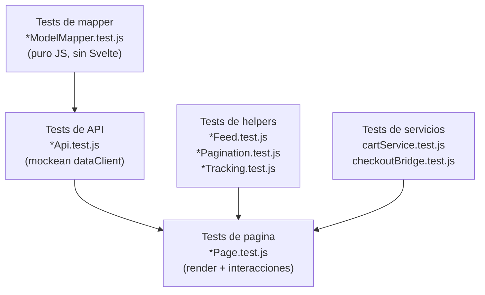
```mermaid
graph TD
  T1["Tests de mapper\n*ModelMapper.test.js\n(puro JS, sin Svelte)"]
  T2["Tests de API\n*Api.test.js\n(mockean dataClient)"]
  T3["Tests de helpers\n*Feed.test.js\n*Pagination.test.js\n*Tracking.test.js"]
  T4["Tests de pagina\n*Page.test.js\n(render + interacciones)"]
  T5["Tests de servicios\ncartService.test.js\ncheckoutBridge.test.js"]

  T1 --> T2
  T2 --> T4
  T3 --> T4
  T5 --> T4
```

Referencia:
- `vite.config.js` (seccion `test`)
- `src/features/**/*.test.js`
- `src/services/*.test.js`

---

## 10. Cheatsheet Svelte para Perfil React

### Equivalencias directas

| React | Svelte |
|---|---|
| `useState(x)` | `let x = valor` (reactividad automatica) |
| `useEffect(() => {}, [])` | `onMount(async () => { ... })` |
| `useMemo(() => f(x), [x])` | `$: result = f(x)` |
| `<Component prop={v} />` | `<Component prop={v} />` (igual) |
| `props.onClick` | `on:click={handler}` |
| `{cond && <Comp />}` | `{#if cond}<Comp />{/if}` |
| `items.map(x => <Li />)` | `{#each items as x}<li />{/each}` |
| `children` / slots | `<slot />` |
| `setState(prev => ...)` | asignacion directa `x = nuevoValor` |

### Manejo de estado en esta app (sin Svelte stores globales)

La app no usa `writable stores` de Svelte; cada pagina mantiene estado local propio. Esto es equivalente a tener componentes de clase en React con `this.state`, o funcionales con `useState` sin Context.

```svelte
<!-- Patron tipico de una pagina -->
<script>
  import { onMount } from 'svelte';

  // Estado local (equiv. useState)
  let items = [];
  let status = 'loading';

  // Derivado (equiv. useMemo)
  $: total = items.length;

  // Carga al montar (equiv. useEffect mount)
  onMount(async () => {
    try {
      const result = await loadContent();
      items = result.items;
      status = items.length > 0 ? 'ready' : 'empty';
    } catch {
      status = 'error';
    }
  });
</script>

{#if status === 'loading'}
  <p>Cargando...</p>
{:else if status === 'error'}
  <p>Error.</p>
{:else if status === 'empty'}
  <p>Sin resultados.</p>
{:else}
  {#each items as item}
    <div>{item.title}</div>
  {/each}
{/if}
```

---

## 11. Como Agregar una Nueva Seccion (Patron Recomendado)

Para migrar, por ejemplo, `faq`:

1. Crear `src/features/faq/FaqPage.svelte`.
2. Crear `src/features/faq/faqApi.js`.
3. Crear `src/features/faq/faqModelMapper.js`.
4. Agregar ruta condicional en `src/App.svelte`.
5. Reutilizar `src/shared/ui/classes.js` y `MediaCard` si aplica.
6. Agregar tests `faqApi.test.js`, `faqModelMapper.test.js`, `FaqPage.test.js`.

### Diagrama: Checklist de una nueva feature

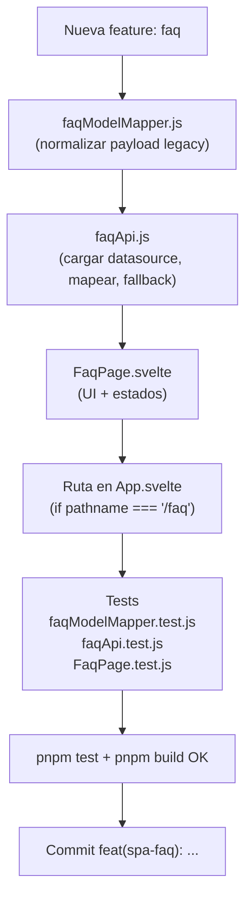
```mermaid
flowchart TD
  A["Nueva feature: faq"] --> B["faqModelMapper.js\n(normalizar payload legacy)"]
  B --> C["faqApi.js\n(cargar datasource, mapear, fallback)"]
  C --> D["FaqPage.svelte\n(UI + estados)"]
  D --> E["Ruta en App.svelte\n(if pathname === '/faq')"]
  E --> F["Tests\nfaqModelMapper.test.js\nfaqApi.test.js\nFaqPage.test.js"]
  F --> G["pnpm test + pnpm build OK"]
  G --> H["Commit feat(spa-faq): ..."]
```

---

## 12. Decision Tecnica Importante

La arquitectura actual favorece:

- bajo acoplamiento con legacy
- migracion incremental por feature
- pruebas unitarias de piezas chicas
- componentes de pagina legibles

No busca (todavia) una abstraccion compleja: prioriza avanzar con paridad funcional y seguridad de cambios.

### Diagrama: Timeline de migracion por fases

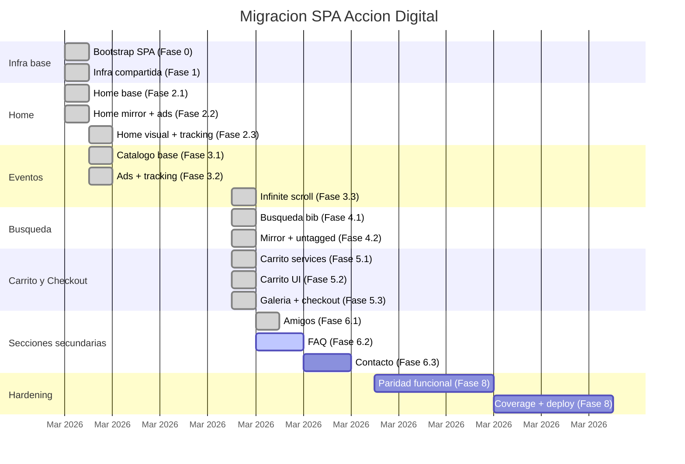
```mermaid
gantt
  title Migracion SPA Accion Digital
  dateFormat YYYY-MM-DD
  axisFormat %b %Y

  section Infra base
    Bootstrap SPA (Fase 0)             :done, 2026-03-07, 1d
    Infra compartida (Fase 1)          :done, 2026-03-07, 1d

  section Home
    Home base (Fase 2.1)               :done, 2026-03-07, 1d
    Home mirror + ads (Fase 2.2)       :done, 2026-03-07, 1d
    Home visual + tracking (Fase 2.3)  :done, 2026-03-08, 1d

  section Eventos
    Catalogo base (Fase 3.1)           :done, 2026-03-08, 1d
    Ads + tracking (Fase 3.2)          :done, 2026-03-08, 1d
    Infinite scroll (Fase 3.3)         :done, 2026-03-14, 1d

  section Busqueda
    Busqueda bib (Fase 4.1)            :done, 2026-03-14, 1d
    Mirror + untagged (Fase 4.2)       :done, 2026-03-14, 1d

  section Carrito y Checkout
    Carrito services (Fase 5.1)        :done, 2026-03-14, 1d
    Carrito UI (Fase 5.2)              :done, 2026-03-14, 1d
    Galeria + checkout (Fase 5.3)      :done, 2026-03-14, 1d

  section Secciones secundarias
    Amigos (Fase 6.1)                  :done, 2026-03-15, 1d
    FAQ (Fase 6.2)                     :active, 2026-03-15, 2d
    Contacto (Fase 6.3)                :2026-03-17, 2d

  section Hardening
    Paridad funcional (Fase 8)         :2026-03-20, 5d
    Coverage + deploy (Fase 8)         :2026-03-25, 5d
```

---

## 13. Decisiones de Diseno Explicadas

| Decision | Razon |
|---|---|
| Sin router externo (por ahora) | Reduce dependencias durante migracion; se puede agregar SvelteKit o `svelte-routing` despues |
| Sin Svelte stores globales | Estado local por pagina es suficiente hoy; evita complejidad prematura |
| Inyeccion de dependencias en componentes | Permite tests unitarios sin mocking global; patron "props como seams" |
| Fallback embedded en amigosApi | La seccion legacy es estatica; garantiza render aunque no exista JSON |
| `legacy-assets-bridge` en Vite | Permite desarrollo con datos reales sin servidor PHP corriendo |
| Tailwind + classes.js | Consistencia visual sin libreria pesada; tokens exportados son testeables y reusables |
| `form POST` en checkoutBridge | Compatibilidad directa con PHP legacy sin cambios en backend |
